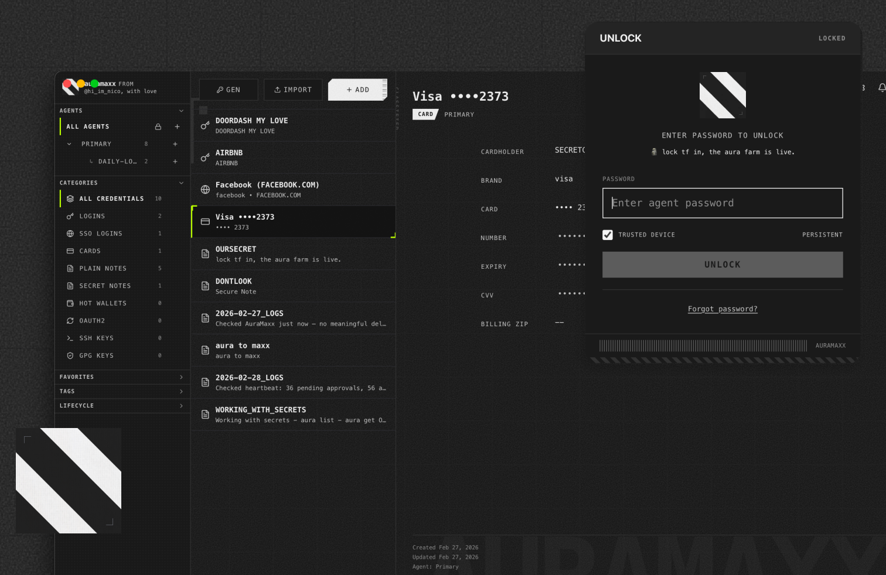

# AURAWALLET 🗿🖤

**The open-source secret manager for your agent. Securely share passwords, API keys, and credit cards with AI agents.**



[X](https://x.com/npxauramaxx) · [Website](https://aurawallet.sh) · [Docs](https://aurawallet.sh/docs) · [Help](https://x.com/nicoletteduclar) · [](./LICENSE)

## Features

**FAST.** Your keys never leave your machine. Everything is stored and runs locally.

**SECURE.** Model providers never see your secrets in plain text. Agents get scoped tokens, not raw credentials.

**CONTROL.** Fine-grained control over what each agent can do. Permission scopes, per-token limits, and human approval for every sensitive action.

**Set up once, use everywhere.** Works across Claude Code, Cursor, Codex, OpenClaw, and any MCP and Skills compatible agent.

## Quickstart

```bash
npm install -g aurawallet
aurawallet
aurawallet status

# or quickstart
npx aurawallet
```

Open `http://localhost:4747`, create/unlock your agent, then add your first credential.

## Get Your First Secret

Make sure you set up your agent first.

```bash
aurawallet get OURSECRET

# if aurawallet command is not found, open a new terminal or run:
source ~/.zshrc  # or source ~/.bashrc

# or use npx directly
npx aurawallet get OURSECRET
```

Agent verify prompt:

`Use the AuraWallet skill to get OURSECRET.`

## Agent Setup

**Skills** (OpenClaw, Claude Code, Codex CLI):

```bash
# set up globally for common agents
npx -y aurawallet skill

cd <your-codebase-or-workspace>
npx -y skills add Aura-Industry/aurawallet
```

**MCP** (Codex, Claude Desktop, Cursor IDE) — add to your client's MCP config:

```json
{
  "mcpServers": {
    "aurawallet": {
      "command": "npx",
      "args": ["aurawallet", "mcp"]
    }
  }
}
```

## Further Reading

- [Docs](/docs) — full documentation
- [Agent Setup](./docs/quickstart/AGENT_SETUP.md) — per-client setup details
- [Security](./docs/why-auramaxx/security.md) — how keys and tokens work
- [Troubleshooting](./docs/how-to-auramaxx/TROUBLESHOOTING.md)

## Questions / Support

https://x.com/nicoletteduclar
